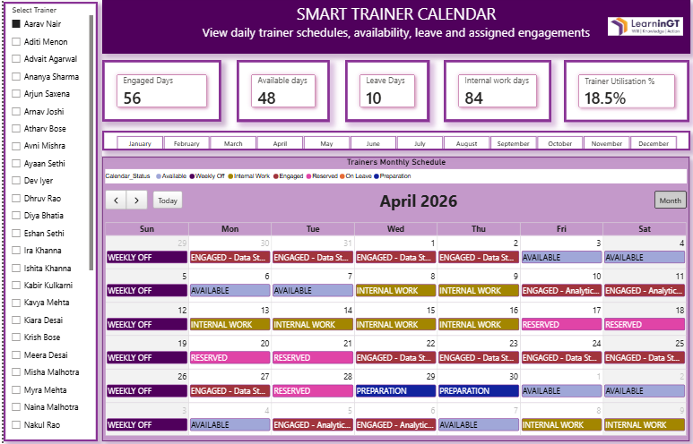

# Smart Trainer Calendar Power BI Report

## Project Overview

This project is an interactive Power BI report designed to simplify trainer scheduling, availability tracking and workforce planning.

The report converts daily trainer scheduling data into a clear visual planning solution where users can monitor trainer availability, confirmed engagements, tentative bookings, preparation work, internal work, leave and weekly offs in one place.

## Objective

The objective of this project is to build a practical workforce scheduling report that helps users answer key planning questions such as:

* Which trainers are available for assignment?
* Which trainers are already engaged?
* Which bookings are confirmed, tentative or open?
* What is the workload and utilisation of each trainer?
* Which trainer is suitable based on specialisation, location and availability?
* How can scheduling decisions be made faster and more clearly?

## Tools Used

* Power BI
* DAX
* Data Modelling
* Power Query
* Calendar Visual
* Slicers and Interactive Filters
* Excel / Sample Data

## Report Pages

The Power BI report includes four main pages:

1. Trainer Workforce Overview
2. Trainer Calendar
3. Trainer 360 Profile
4. Schedule Control Centre

## Key Features

### 1. Trainer Workforce Overview

The overview page provides a high-level summary of trainer availability, engagement, leave and utilisation.

It includes:

* Total trainers
* Engaged days
* Available days
* Leave days
* Trainer utilisation percentage
* Monthly workforce status
* Overall schedule distribution
* Specialisation-wise workload and utilisation
* Trainer profile summary

### 2. Trainer Calendar

The Trainer Calendar page provides a month-wise view of each trainer’s daily schedule.

It tracks statuses such as:

* Available
* Engaged
* Reserved
* Preparation
* Internal Work
* On Leave
* Weekly Off

This page helps users quickly understand when a trainer is available, occupied or blocked for other work.

### 3. Trainer 360 Profile

The Trainer 360 page gives a complete profile view of a selected trainer.

It includes:

* Trainer name
* Specialisation
* Base city
* Experience
* Rating
* Contact details
* Engaged days
* Available days
* Leave days
* Total engagements
* Trainer utilisation percentage
* Monthly workload chart
* Engagement type mix

### 4. Schedule Control Centre

The Schedule Control Centre provides a detailed scheduling table for operational review.

It includes:

* Calendar date
* Day name
* Calendar status
* Booking status
* Client organisation
* Training programme
* Engagement type
* Project status
* Delivery mode
* Venue city

This page helps in tracking confirmed, tentative, open and blocked schedules in a structured format.

## Important Measures

The report uses DAX measures for accurate and interactive analysis.

Key measures include:

* Total Trainers
* Engaged Days
* Available Days
* Leave Days
* Internal Work Days
* Total Engagements
* Capacity Days
* Trainer Utilisation %

## Trainer Utilisation Logic

Trainer utilisation is calculated based on engaged days compared to working capacity days.

Working capacity excludes non-working days such as weekly offs and leave.

This helps show how much of a trainer’s available working capacity is actually used for confirmed engagements.

## Data Model

The report is built using a simple data model with fact and dimension tables.

Main tables used:

* Fact_TrainerCalendar
* Dim_Date
* Dim_Trainer

Relationships:

* Dim_Date is connected to Fact_TrainerCalendar using Calendar Date
* Dim_Trainer is connected to Fact_TrainerCalendar using Trainer ID

This model helps the report respond correctly to filters, slicers and date selections.

## Screenshots

### Trainer Workforce Overview


### Trainer Calendar


### Trainer 360 Profile


### Schedule Control Centre



## Files Included

* Power BI report file
* Sample Excel data file
* Report screenshots
* README documentation

## Repository Structure

```text
Smart-Trainer-Calendar-PowerBI/
│
├── README.md
├── Smart-Trainer-Calendar.pbix
├── Trainer-Calendar-Sample-Data.xlsx
│
└── screenshot/
    ├── Capture 1.PNG
    ├── Capture 2.PNG
    ├── Capture 3.PNG
    └── Capture.PNG
```

## Learning Outcomes

Through this project, I improved my understanding of:

* Power BI report design
* Data modelling
* DAX measures
* Date table usage
* Calendar-based reporting
* Slicer interactions
* Workforce planning analysis
* Resource scheduling logic
* Business-focused data storytelling

## Conclusion

This project helped me understand how Power BI can be used not only for reporting, but also for practical workforce planning and schedule management.

The report supports faster, clearer and more informed decision-making by bringing trainer availability, workload, engagement status and schedule control into one interactive solution.

## Note

This repository uses sample or dummy data for portfolio demonstration purposes. Any confidential, internal or sensitive information has been removed.
